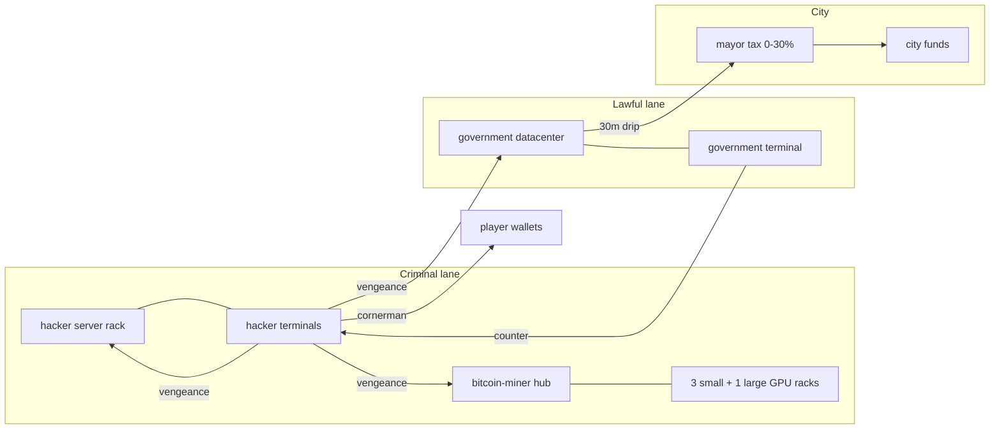

# LIFEPUNCH Cyber Ecosystem — master canon

**Brand:** LIFEPUNCH™ · **Publish family:** LPaddons (oneliner hub folders)  
**Status:** Owner-greenlit · Red implements · Green distills  
**Not three random addons** — one criminal ↔ lawful ↔ city treasury loop.

---

## 1. The loop



**Core rule:** If you run illegal infra, **other hackers can hit you too.**

---

## 2. UI families (three skins, one platform)

| Skin | Hex | Program | Addon | Interaction |
|------|-----|---------|-------|-------------|
| **Cornerman** | `#00FF7F` | `cornerman.exe` | `hackerjob` | Type command → click to confirm spends |
| **Vengeance** | `#E4002B` | `vengeance.exe` | `hackerjob` | + govdb / miner intrusion |
| **HASHD** | `#f0a500` | hashd rig control | `bitcoinmining` | **Keep menu as-is** + encryption tab |
| **lifepunchnet** | `#00D4FF` | `lifepunch-ops.exe` | `governmentdatacenter` | FBI / Cyber counter-hack |

Hacker job is **not a pure console job** — world props + modules + typing as **authentication**, not chat-only roleplay.

---

## 3. Entities & caps

### Bitcoin (`bitcoinmining`)

| Entity | Slug | Max per player | HP |
|--------|------|----------------|-----|
| Bitcoin Miner hub | `bitcoin-miner` | **2** | **250** |
| GPU Rack | `gpu-rack` | **3 per hub** | **500** |
| Advanced GPU Rack | `advanced-gpu-rack` | **1 per hub** | **2000** |

- Hub **command power ON** → hub anim + startup sound → menu rack buttons enabled.
- Hub **encryption** upgrades defend against vengeance hacks.
- **Deprecated:** `bitcoin-terminal` (menu on hub).

### Hacker (`hackerjob`)

| Entity | Tier | Upgrades |
|--------|------|----------|
| Server rack | Basic | ON/OFF · **3 skills × 1 point** |
| Advanced server | Advanced | **4–5 skills × 3 points** |
| Standard terminal | Basic | ON/OFF only (no upgrade tree) |
| Advanced terminal | Advanced | Intrusion UI only — upgrades on **server** |

### Government (`governmentdatacenter`)

| Entity | Role |
|--------|------|
| Government datacenter | Landmark + passive BTC treasury (**$50k cap**) |
| Government terminal | FBI / Cybersecurity counter-hack + legal pay puzzles |

- **30 min** tick: `floor(btc × $1500 × mayorTaxRate)` → city funds (`taxRate` 0–30%).
- Lawful jobs solve puzzles for pay; criminals use vengeance to breach.

---

## 4. Economy bands (owner canon 2026-06)

| Action | Base (pre-upgrade) |
|--------|-------------------|
| Wallet hack | **$1,000 – $2,500** |
| Criminal miner steal | Capped by hub **Wallet Cipher** |
| Gov treasury breach | Hard puzzles; payout good not broken |
| City treasury cap | **$50,000** BTC value |

Host validation = Opus Phase 2.

---

## 5. Upgrade standard

| Tier | Slots | Points | Jobs |
|------|-------|--------|------|
| Basic hardware | 3 skills | 1 pt each | Standard terminal + server rack |
| Advanced hardware | 4–5 skills | 3 pts each | Advanced terminal + advanced server |
| Money farming | More tiers | CPU, cores, encryption, RGB… | `bitcoin-miner` + racks |

**Mirrored PvP:**

- Hacker rack: Detection, Puzzle Time, Reward, Cooldown (offense)
- Bitcoin hub: Firewall, Cipher, Alert, Re-hack CD, Puzzle Hardening (defense)

---

## 6. Animation & sound order (bitcoin)

```text
POWER ON  → startup sound → fan loop + power_on anim
POWER OFF → fans ramp down → power_off anim
DAMAGE    → metal hit (per strike)
DEATH     → smoke → explode
```

Preserve ModelDoc sequences on GPU racks and Ophion hub — do not replace with placeholder spin long-term.

---

## 7. Implementation phases

| Phase | Red | Green |
|-------|-----|-------|
| **A** | Asset intake + ModelDoc + HP constants | Distill specs, upgrade tables, UI wireframes |
| **B** | Hub entity, rack registry, encryption catalog | PvP flow one-pagers |
| **C** | Host economy + steal caps | — |
| **D** | Gov datacenter + cyan ops UI | Police command tables |

---

## 8. Related docs

- `ASSET_INTAKE_CYBER_ECOSYSTEM.md` — what owner drops and where
- `GOVERNMENT_DATABASE_SPEC.md` — treasury (update cap/tick)
- `HACKER_OPS_CONSOLE_SPEC.md` — green/red UI
- `briefs/CORNERMAN_CYBER_ECOSYSTEM_TASK.md` — Green distill lane
