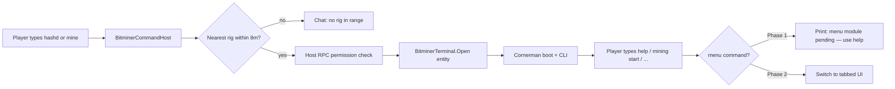

# Cornerman task — Bitcoin Miner terminal (Phase 1 CLI)

**Lane:** Cornerman (Qwen 2.5 / Tier-3) → commit on Green → owner integrates on VENGEANCE  
**Model routing:** This is a **multi-file C# + Razor port** with DXRP dual-build seams. Cornerman may **draft**; **Opus on VENGEANCE must review** before “done.”  
**Issued:** 2026-06-11

---

## Goal

Ship the **Bitcoin Miner** interactive entity with a **Cornerman hacker terminal** that mirrors Evo’s **code architecture** (entity RPCs, synced state, terminal host) but is **visually and verbally LIFEPUNCH** — and opens via **typed in-game commands**, not Evo’s interact-only flow.

**Phase 1 (this task):** Full CLI terminal + command gate.  
**Phase 2 (later, VENGEANCE):** Tabbed menu (`menu` command + Dashboard/Wallet/Upgrades tabs) per `BITMINER_UX_SPEC.md`.

---

## What to copy vs rewrite

| Copy structure from `reference/evo-bitminer/` | Rewrite / never ship |
|-----------------------------------------------|----------------------|
| `BitminerEntity.cs` — economy, RPCs, fans, screen text | Evo cloud model paths, Evo sounds, `BitOS` / `root@bitminer` copy |
| `BitminerTerminalHost.cs` — dual-build mount/close | Blue `#44aaff` theme |
| `BitminerTerminal.razor` — CLI loop, `HandleCommand` | `credits` → Spl Mute / Null. |
| `BitminerTerminal.razor.scss` — layout shell | Colors → Cornerman palette |

**Namespace (ship tree):** `LifePunch.DXRP.Addons.BitcoinMining` — match existing `Bitminer.cs`.

**Proprietary header** on every new `.cs`, `.razor`, `.scss` (see `dxrp-addon-foundation` rule; title = `"Bitcoin Mining"`).

---

## Open flow — commands first (differs from Evo)

Evo: **use key on entity** → terminal.  
LifePunch Phase 1: **type a command** → terminal mounts on **nearest** `BitminerEntity` in range.



### Console / chat commands (implement in new `BitminerCommandHost.cs`)

| Command | Action |
|---------|--------|
| `hashd` | Open terminal on nearest rig (8m horizontal, 4m vertical) |
| `mine` | Alias of `hashd` |
| `hashd close` / `mine close` | Close open terminal if any |

Pattern: copy `[ConCmd]` style from `StaffMenuHost.cs` (`staffmenu` / `adminmenu`).

**Nearest rig:** scan `Scene.GetAllComponents<BitminerEntity>()`, filter by distance from local viewer, pick minimum. Use `BitminerTerminalHost.LocalViewerPosition`.

**Optional (nice):** keep `Component.IPressable` on entity as **secondary** open path (Evo parity) — but commands are the **documented** primary for Phase 1.

---

## Cornerman terminal branding

From `lifepunch/branding/cornerman/THEME.md` + `BITMINER_UX_SPEC.md`:

| Token | Hex |
|-------|-----|
| Background | `#0a0f0a` |
| Border | `#1a3a2a` |
| Primary | `#00FF7F` |
| Body text | `#d8ffe8` |
| Error | `#e4002b` |

| Evo string | LifePunch string |
|------------|------------------|
| `BitOS 1.0 — root@bitminer` | `LIFEPUNCH hashd v1.0 — cornerman@rig` |
| `root@bitminer:~$` | `cornerman@rig:~$` |
| Boot: `Starting BitOS 1.0` | See boot block below |
| `Device: Bitminer S1` | `Device: Bitcoin Miner` |
| `credits` command | **Remove** — replace with `about` → LIFEPUNCH™ line only |

### Boot sequence (on open)

```text
LIFEPUNCH hashd v1.0
[ OK ] memory 256mb
[ OK ] gpu-rack mesh
[ OK ] mounting /dev/rig0
starting mine.exe ...
Type 'help' for commands. Type 'menu' for graphical UI (coming soon).
```

---

## In-terminal CLI commands (Phase 1)

Port Evo `HandleCommand` logic **unchanged in behavior**; rebrand strings only.

| Command | Args | RPC / action |
|---------|------|--------------|
| `help` | — | List commands |
| `clear` | — | Wipe scrollback |
| `status` | — | Live-updating block (keep Evo refresh) |
| `info` | — | Device specs |
| `bitcoin` | — | Show balance |
| `bitcoin` | `sell` | `Miner.RequestSellBitcoin()` |
| `mining` | — | Status hint |
| `mining` | `start` / `stop` | `Miner.SetMiningState(...)` |
| `upgrade` | — | Upgrade menu text |
| `upgrade` | `cpu` / `cores` | `Miner.RequestUpgrade(...)` |
| `menu` | — | **Stub:** `"Graphical menu module not loaded. Use CLI commands (help)."` |
| `about` | — | LIFEPUNCH attribution (no third-party credits) |

Economy constants: **do not change** — see `BITMINER_UX_SPEC.md` §2.

---

## Files to create (ship tree)

```text
lifepunch/addons/Code/Addons/lifepunch/bitcoinmining/
  BitminerEntity.cs          ← port from reference (+ Title "Bitcoin Miner")
  BitminerTerminalHost.cs    ← port from reference (namespace fix)
  BitminerCommandHost.cs     ← NEW — ConCmd open/close + nearest-rig resolver
  BitminerTerminal.razor     ← port + rebrand + menu stub
  BitminerTerminal.razor.scss← Cornerman palette (keep Evo layout)
  docs/RUNTIME_PATTERN.md    ← append terminal/command section
  docs/BITMINER_BUILD.md     ← tick items as done
```

**Do not** copy reference `Bitminer.cs` — ship tree already has paths/constants in `Bitminer.cs` (`bitcoin-miner`, `gpu-rack`).

**World model path in entity:** `Bitminer.WorldModelPath` from ship `Bitminer.cs`.

---

## Dual-build rules (non-negotiable)

Same as reference `RUNTIME_PATTERN.md`:

- `#if LIFEPUNCH_LOCAL` — editor-safe stubs for `PayHost` / `ChargeHost` / permissions.
- `#else` — real `Dxura.RP.Game` types.
- **All `#if` in `.cs` only** — Razor stays define-free; use `BitminerTerminalHost` for viewer position + mount.

---

## Assets (already in repo — wire paths only)

| Asset | Path |
|-------|------|
| World mesh | `models/.../gpu-rack/gpu-rack.vmdl` (ModelDoc TODO on Red — stub OK in local) |
| Prefab | `entities/bitcoin-miner/bitcoin-miner.prefab` (TODO — entity can compile before prefab) |
| Sounds | `sounds/bitcoin-miner/*.sound` (TODO — nullable `SoundEvent` until recorded) |

---

## Validation (Green / Cornerman)

```powershell
powershell -File lifepunch/addons/scripts/validate-layout.ps1
```

Manual checklist:

- [ ] `hashd` opens terminal when standing near a placed rig
- [ ] `hashd` with no rig → clear chat error
- [ ] `mining start` / `stop` toggles synced state
- [ ] `bitcoin sell` calls host RPC
- [ ] Terminal auto-closes >150m from rig
- [ ] No Evo author strings, no cloud model paths
- [ ] Proprietary headers on all new sources

---

## Handoff back to VENGEANCE (Red)

1. `git pull` on VENGEANCE after owner pushes Cornerman commits  
2. Opus review dual-build + RPC security  
3. ModelDoc `gpu-rack.vmdl` + `bitcoin-miner.prefab`  
4. Phase 2: tabbed menu — `menu` command flips `_viewMode` like `StaffMenu` tabs  

---

## Reference file index (read-only)

```text
reference/evo-bitminer/Code/Addons/lifepunch/bitcoinmining/
  BitminerEntity.cs
  BitminerTerminalHost.cs
  BitminerTerminal.razor
  BitminerTerminal.razor.scss

lifepunch/addons/Code/Addons/lifepunch/adminmenu/StaffMenuHost.cs   ← ConCmd pattern
lifepunch/addons/docs/BITMINER_UX_SPEC.md                           ← Phase 2 menu spec
lifepunch/branding/cornerman/THEME.md                               ← palette
```

**Deliverable:** One focused commit on Cornerman: `feat(bitcoinmining): Cornerman CLI terminal + hashd command gate (Phase 1)`
