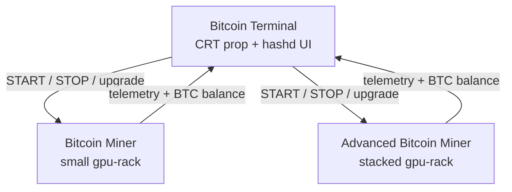

# Bitcoin Mining — three-entity architecture (owner canon)

**Issued:** 2026-06-11 · **Status:** Red split in progress · Green distills remote-control UX  
**Supersedes:** “both racks on one `bitcoin-miner` prefab” in `BITCOINMINING_DUAL_RACK_BRIEF.md` §Prefab layout

---

## The three placeables

| # | Player-facing name | Repo slug | Mesh | Role |
|---|-------------------|-----------|------|------|
| 1 | **Bitcoin Terminal** | `bitcoin-terminal` | `computer.fbx` → `bitcoin-terminal.vmdl` | **Control station** — hashd console, upgrades, remote rack on/off |
| 2 | **Bitcoin Miner** | `bitcoin-miner` | `gpu-rack-static.obj` → `gpu-rack.vmdl` | **Small rack** — mines when terminal (or linked logic) says START |
| 3 | **Advanced Bitcoin Miner** | `advanced-bitcoin-miner` | `gpu-rack-stacked-anim.fbx` → `gpu-rack-stacked.vmdl` | **Large stacked rack** — higher yield; same remote control |

Racks are **dumb hardware**. The terminal is the **only** place players manage mining, upgrades, and (eventually) which racks are online.



---

## Two UIs on the terminal entity

| Layer | What it is | Where |
|-------|------------|-------|
| **hashd console** | Full-screen Razor overlay — `HashdTerminal.razor` | Opens on `hashd`, USE on CRT, or START rail |
| **LCD summary** | World `TextRenderer` on `lcd_screen` child | Amber one-line status on CRT monitor face |

The CRT mesh does **not** embed the hashd UI — the console is a screen-space panel (same pattern as hacker job ops console).

---

## hashd console layout (shipped Phase 1)

```text
┌─ HASHD RIG CONTROL v1 ─────────────────────────────── CLOSE ─┐
│ LIVE TELEMETRY │  >> hashd init — LIFEPUNCH mining daemon    │
│ STATUS  IDLE   │  >> linking gpu-rack telemetry bus ... OK   │
│ BALANCE 0 BTC  │  Commands: help · mining · bitcoin · ...    │
│ VALUE   $0     │                                              │
│ HASH  2.44 GHz │  rig0> _                                     │
│ CORES   1      │                                              │
│ TICK ████░░    │                                              │
│ [START][STOP]  │                                              │
└────────────────┴──────────────────────────────────────────────┘
```

**See it now (editor):**

1. Sync addon → DXRP (`Sync-LifePunchAddonsToDxrp.ps1 -Addon bitcoinmining`).
2. Enter play mode.
3. Console: `lp_hashd_preview` (spawns kit + opens hashd) **or** `lp_spawn_gpu_rack` then `hashd`.
4. Type `help`, `status`, `mining start`, `upgrade`.

CRT world mesh is optional for the UI — `hashd` only needs a `GpuRackEntity` within 8 m.

---

## Shipped vs TODO (2026-06-11)

| Piece | Status |
|-------|--------|
| `bitcoin-miner.prefab` (small rack only) | **Shipped** — no terminal child |
| `bitcoin-terminal.prefab` (CRT + `BitcoinTerminalProp`) | **Shipped** — links nearest rig ≤4 m |
| `HashdTerminal.razor` hashd CLI | **Shipped** Phase 1 |
| `bitcoin-terminal.vmdl` compile (`_c`) | **BLOCKER** — ModelDoc compile on VENGEANCE (ERROR mesh until `_c` exist) |
| `advanced-bitcoin-miner.prefab` | **Shipped** — `AdvancedRack` = 2× yield |
| `gpu-rack-stacked.vmdl` | **Shipped** — compile in ModelDoc for `_c` |
| Terminal controls **multiple** racks remotely | **TODO** — Green spec → Red `GpuRackRegistry` |
| Per-rack START/STOP from terminal | **TODO** — today START/STOP hits one linked `GpuRackEntity` |

---

## Linking model (current → target)

**Current (Phase 1 split):**

- `BitcoinTerminalProp` auto-links **one** nearest `GpuRackEntity` within 4 m.
- `hashd` opens UI bound to that rig’s economy state.

**Target (owner canon):**

- Terminal owns a **rig registry** (synced list of registered rack entity IDs in range).
- `racks` / `mining start <id>` / rail buttons target a selected rack.
- Small vs Advanced rack types differ by prefab + yield multiplier — not by parenting meshes together.

---

## Prefab paths

```text
entities/bitcoin-terminal/bitcoin-terminal.prefab
entities/bitcoin-miner/bitcoin-miner.prefab
entities/advanced-bitcoin-miner/advanced-bitcoin-miner.prefab
```

---

## What the player sees

1. **World:** Amber-lit **Bitcoin Terminal** CRT (when `bitcoin-terminal.vmdl` compiled) placed near one or more **GPU racks** (small + optional advanced stacked unit). Racks spin fans / play power anim while mining.
2. **Overlay:** Full **hashd** panel (`HashdTerminal.razor`) — amber `#f0a500` telemetry rail + `rig0>` log. This is the real control console.
3. **LCD:** One-line amber `TextRenderer` on the CRT monitor — balance / status summary only (not the full UI).
4. **Fast preview:** `lp_hashd_preview` opens the console immediately without waiting on CRT ModelDoc compile.

Remote rack list + multi-rig START: `BITCOINMINING_REMOTE_RACK_SPEC.md`.

---

## Related

- `docs/briefs/CORNERMAN_BITCOINMINING_THREE_ENTITY_TASK.md` — Green distill
- `BITCOINMINING_REMOTE_RACK_SPEC.md` — multi-rig hashd UX + linking rules
- `BITCOINMINING_DUAL_RACK_SPEC.md` — economy numbers (yield multiplier still valid; single-prefab layout **obsolete**)
- `BITCOINMINING_PLAYTEST.md` — smoke commands
- `RED_BITCOINMINING_PHASE2_BUILD.md` — tabbed modules on hashd console
