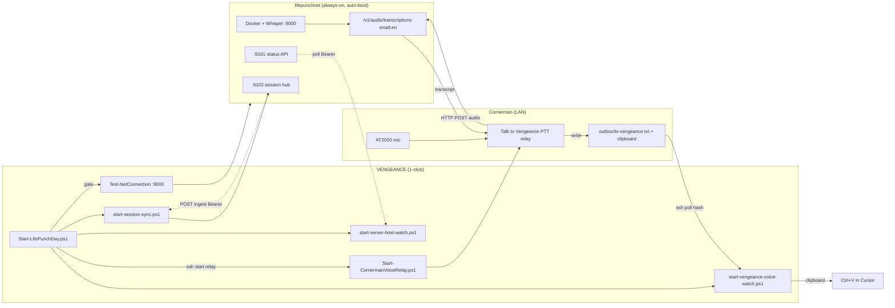

# LifePunch Start Day — architecture

One desktop action on VENGEANCE: **LifePunch — Start Day** (`Start-LifePunchDay.ps1`).

VENGEANCE does **not** SSH to lifepunchnet in v1 — hosted services must auto-boot on the server. Desk only **verifies** `:9000` (gate) and optionally polls `:9101` / `:9102`.

## Flow (canonical)

## Corrections vs informal sketch

| Sketch | Actual |
|--------|--------|
| `R --> text --> start-server-host-watch` | **Wrong.** Host watch polls **:9101 health** only. Transcripts go `outbox → voice watch → clipboard`. |
| Only one watcher on VENGEANCE | Start Day launches **three** windows: voice watch, session sync, host watch. |
| `LP --> A` (push) | **Pull model.** VENGEANCE polls lifepunchnet (`Test-NetConnection`, `:9101`, `:9102`); lifepunchnet does not call VENGEANCE. |

## Operator round (PTT)

1. **F7** tap on Cornerman → TTS **Ready**
2. **F8** hold → speak → release
3. Cornerman → lifepunchnet Whisper → `to-vengeance.txt` + clipboard
4. VENGEANCE voice watch → **PASTE NOW** → **Ctrl+V** in Cursor
5. Session sync archives to **:9102** (async)

## Boot vs Start Day

| When | Where | What |
|------|-------|------|
| Reboot / logon | **lifepunchnet** | `Install-LifePunchNetBoot.ps1` → :9000 / :9101 / :9102 |
| Desk session | **VENGEANCE** | **LifePunch — Start Day** → gate + watchers + Cornerman relay |

## Related

- `Start-LifePunchDay.ps1` — orchestrator
- `Install-LifePunchNetBoot.ps1` — lifepunchnet boot wiring
- `LIFEPUNCH_PARTY_HANDOFF.md` — three-party checklist
- `VOICE_PIPELINE_STATUS.md` — service ports + config
- `VOICE_TEST_CHECKLIST.md` — success criteria
